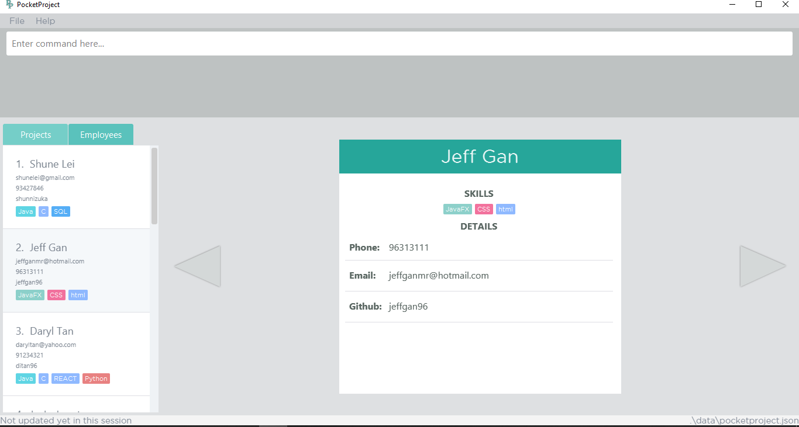

= PocketProject
ifdef::env-github,env-browser[:relfileprefix: docs/]

https://travis-ci.org/cs2103-ay1819s2-w10-2/main[image:https://travis-ci.org/se-edu/addressbook-level4.svg?branch=master[Build Status]]
https://ci.appveyor.com/project/damithc/addressbook-level4[image:https://ci.appveyor.com/api/projects/status/3boko2x2vr5cc3w2?svg=true[Build status]]
https://coveralls.io/github/cs2103-ay1819s2-w10-2/main?branch=master[image:https://coveralls.io/repos/github/cs2103-ay1819s2-w10-2/main/badge.svg?branch=master[Coverage Status]]
image:https://api.codacy.com/project/badge/Grade/080dcd6a5aad4e0e9829b5856de10027["Codacy code quality", link="https://www.codacy.com/app/jothipillay/main?utm_source=github.com&amp;utm_medium=referral&amp;utm_content=cs2103-ay1819s2-w10-2/main&amp;utm_campaign=Badge_Grade"]

ifdef::env-github[]

endif::[]

ifndef::env-github[]
image::images/Ui.png[width="600"]
endif::[]

* PocketProject (Project Manager)

* This is a desktop Project Manager application. Most of the user interactions happen using a CLI (Command Line Interface)
and there is   also a GUI to support the system. It is an application using Java as the main programming language.

* It is intended for managers who are in charge of many software engineering projects and who have a large number of
employees assigned to each project at any given time.

* Managers can view details of their projects and employees such as:
** Employee
*** Employee's name, phone number and email
*** Employee's github profile
*** Projects an employee is working on

** Project
*** Deadline
*** Client
*** Milestones
*** User stories
*** Project tasks

== Site Map

* <<UserGuide#, User Guide>>
* <<DeveloperGuide#, Developer Guide>>
* <<AboutUs#, About Us>>
* <<ContactUs#, Contact Us>>

== Authors

* Daryl Tan (https://github.com/ditan96[@ditan96])
* Jeff Gan (https://github.com/jeffgan96[@jeffgan96])
* Jothinandan Pillay (https://github.com/jothipillay[@jothipillay])
* Lin Dehui (https://github.com/dehui333[@dehui333])
* Shune Lei (https://github.com/shunnizuka[@shunnizuka])

== Acknowledgements

* PocketProject is based on the AddressBook-Level4 project created by SE-EDU initiative at https://github.com/se-edu/
* Some parts of this application were inspired by the excellent
http://code.makery.ch/library/javafx-8-tutorial/[Java FX tutorial] by _Marco Jakob_.
* Libraries used: https://github.com/TestFX/TestFX[TextFX], https://github.com/FasterXML/jackson[Jackson],
https://github.com/google/guava[Guava], https://github.com/junit-team/junit5[JUnit5]

== Licence : link:LICENSE[MIT]
